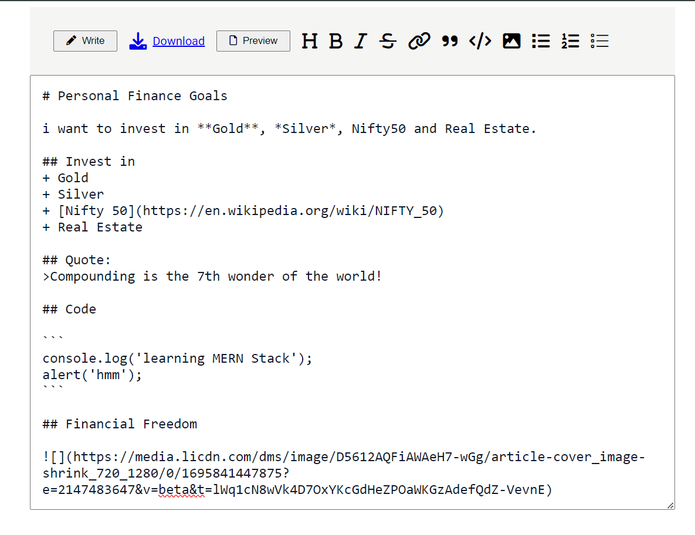

# Module#5 React Day #8 Classwork: Markdown Editor WebApp


## Hosted Version of the Project:
[m5react-day-8-classwork-markdown-editor-webapp](https://m5react-day-8-classwork-markdown-editor-webapp.vercel.app/)

## Objective
Developed a Markdown editor using the Markdown package integrated with React.js. The editor provide users with the ability to create and edit Markdown content, displaying a live preview side by side. Additionally, implemented a feature that allows users to effortlessly generate README.md files from the Markdown content. Ensured a user-friendly interface with customizable themes and styles for an enhanced editing experience. This project aims to simplify Markdown editing, aid content visualization, and streamline README file creation for developers and content creators.


## How to install and run in yours local machine
```bash
npm install
npm run start
```

## Tech. Stack Used:
+ [React](https://react.dev/)
+ [TailwindCSS](https://tailwindcss.com/)
+ [Google Fonts](https://fonts.google.com/)
+ [Font Awesome](https://fontawesome.com/icons/)

## Author
[Abhishek kumar](https://www.linkedin.com/in/alex21c/), ([Geekster](https://geekster.in/) MERN Stack FS-14 Batch)


